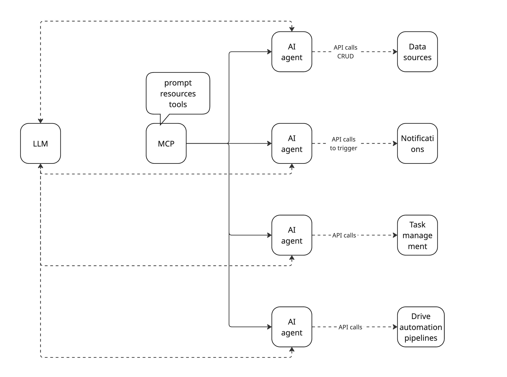

<!-- 

-->

## When AI goes off script

### Tales from the docs pipelines

by

Marco Spinello
Senior technical writer
Booking.com

---

### <i class="fa-regular fa-face-smile"></i> The good
   

### <i class="fa-regular fa-face-frown"></i> The bad
   

### <i class="fa-regular fa-face-angry"></i> The ugly

---

## About me

- ✍️ Tech writer with no CS background
- 🔍 Before AI, Google and StackOverflow were my job security
- 🐾 As curious as a cat

---

## Docs automation

Docs automation workflow main ingredients:

- 🏗️ CI/CD pipelines
- 📝 Scripts and config files
- 🐳 Containers
- 🌐 APIs for data exchange and interoperability 
- ...

---

... Oh yes, and AI to turn a robust pipeline into a house of cards 🙄

---

## AI-enhanced docs pipelines

AI helps with ancillary tasks:

- 😌 Simple
- 🔁 Repetitive
- ⏳ Time-consuming

---

<pre class="mermaid">
---
config:
  theme: forest
  look: handDrawn
---
flowchart TB
    A["AI docs automation workflows"] --> B["Gather and review information"] & C["Author docs"] & D["SME Review docs, code"] & E["Bulk operations"] & F["APIs"]
    B --> G["Code repos Jira issues"] & H["Wiki GDocs"]
    C --> J["Code comments"] & K["README in repos"]
    D --> L["Code comments Git PRs/MRs"] & M["README in repos Wiki, GDocs articles"]
    E --> N["img alt text"] & O["Missing descriptions "] & P["Translations"]
    F --> Q["CRUD on data"] & R["Orchestration"]
    R --> S["Coordinate AI agents "] & T["Triggers, events, actions, notifications"] & U["Manage and process tasks/jobs"] & V["Indexing"]
    A@{ shape: rounded}
    B@{ shape: rounded}
    C@{ shape: rounded}
    D@{ shape: rounded}
    E@{ shape: rounded}
    F@{ shape: rounded}
    G@{ shape: rounded}
    H@{ shape: rounded}
    J@{ shape: rounded}
    K@{ shape: rounded}
    L@{ shape: rounded}
    M@{ shape: rounded}
    N@{ shape: rounded}
    O@{ shape: rounded}
    P@{ shape: rounded}
    Q@{ shape: rounded}
    R@{ shape: rounded}
    S@{ shape: rounded}
    T@{ shape: rounded}
    U@{ shape: rounded}
    V@{ shape: rounded}
    style A color:#616161
    style F fill:#FFD600,stroke:#FF6D00
    style Q fill:#FFD600,stroke:#FF6D00
    style R fill:#FFD600,stroke:#FF6D00
    style S fill:#FFD600,stroke:#FF6D00
    style T fill:#FFD600,stroke:#FF6D00
    style U stroke:#FF6D00,fill:#FFD600
    style V fill:#FFD600,stroke:#FF6D00
    linkStyle 4 stroke:#000000,fill:none
    linkStyle 14 stroke:#000000,fill:none
</pre>

---

So far, results have been a mixed bag:
- Some good 👍
- Some bad 👎
- Some ugly 💩

---

## Good 👍

---

## Bad 👎

---

## Ugly 💩

---

## The value of APIs

APIs are the foundational plumbing of the pipelines:

| Gophers | Orchestrators |
|---|---|
| Retrieve data | Coordinate AI agents |
| Create new data | AI sidekick for MCP interactions (ex: MCP tools and resources) |
| Modify existing data | Manage tasks (queue, run, monitor) |
| Delete data | Initiate actions (ex: webhooks) |
| | Handle notifications |

---

---

---

## AI fails

- [Therapy chatbot](https://futurism.com/therapy-chatbot-addict-meth)
- [Blackmailing colleague](https://www.bbc.com/news/articles/cpqeng9d20go)
- [Lying an scheming](https://time.com/7202784/ai-research-strategic-lying/)
- [Running a company](https://futurism.com/professors-company-ai-agents) \
  See also [The Agent Company](https://the-agent-company.com/)
- [Customer support](https://futurism.com/klarna-ai-automation-engineers)

---

## AI fail winner

...

<i class="fa-solid fa-drum"></i>

...

---

---

## Merci beaucoup!

Merci beaucoup!

---

## 9. Speaker notes and images

<!-- Can also do a multiline
comment that will show in notes -->
