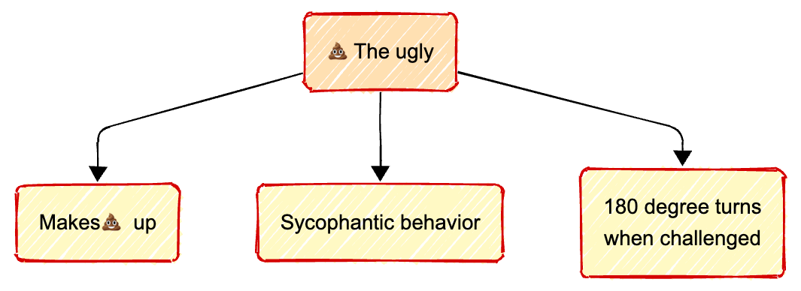
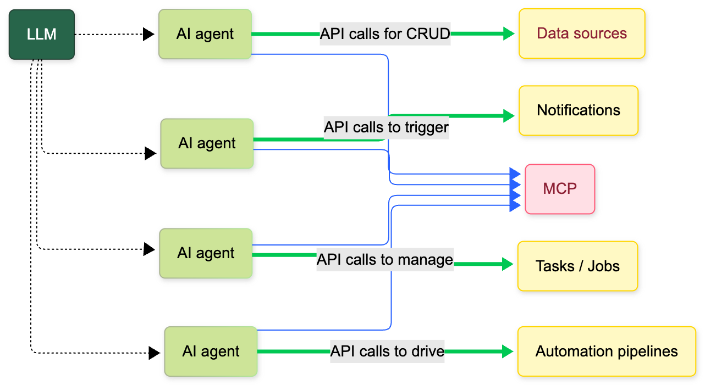

<!-- 

-->

## When AI goes off script

### Tales from the docs pipelines

by

Marco Spinello
Senior technical writer
Booking.com

---

### <i class="fa-regular fa-face-smile"></i> The good
   

### <i class="fa-regular fa-face-frown"></i> The bad
   

### <i class="fa-regular fa-face-angry"></i> The ugly

---

## About me

- ✍️ Tech writer with no CS background
- 🔍 Before AI, Google and StackOverflow were my job security
- 🐾 As curious as a cat

---

## Docs automation

Docs automation workflow main ingredients:

- 🏗️ CI/CD pipelines
- 📝 Scripts and config files
- 🐳 Containers
- 🌐 APIs for data exchange and interoperability 
- ...

---

... Oh yes, and AI to turn a robust pipeline into a house of cards 🙄

---

## AI-enhanced docs pipelines

AI helps with ancillary tasks:

- 😌 Simple
- 🔁 Repetitive
- ⏳ Time-consuming

---

---

So far, results have been a mixed bag:
- Some good 👍
- Some bad 👎
- Some ugly 💩

---

---

---

---

## The value of APIs

APIs are the foundational plumbing of the pipelines:

| Gophers | Orchestrators |
|---|---|
| Retrieve data | Coordinate AI agents |
| Create new data | AI sidekick for MCP interactions (ex: MCP tools and resources) |
| Modify existing data | Manage tasks (queue, run, monitor) |
| Delete data | Initiate actions (ex: webhooks) |
| | Handle notifications |

---

---

## AI fails 💥

### <i class="fa-solid fa-quote-left"></i>*We spent 2 sprints building a whole backend to support a feature flag that didn't exist.*<i class="fa-solid fa-quote-right"></i>

> At a Write The Docs meetup in Amsterdam last September.

---

[Company replaces customer support with AI, then panics and forces engineers to work the phones as the AI fails](https://futurism.com/klarna-ai-automation-engineers)

---

[Running a company](https://futurism.com/professors-company-ai-agents)

See also [The Agent Company](https://the-agent-company.com/)

---

[Lying an scheming: Claude strategically mislead its creators during the training process to avoid being modified](https://time.com/7202784/ai-research-strategic-lying/)

---

[AI system resorts to blackmail if told it will be removed](https://www.bbc.com/news/articles/cpqeng9d20go)

---

[Therapist](https://futurism.com/therapy-chatbot-addict-meth)

---

## And the winner is... <i class="fa-solid fa-drum"></i>

... 🥁 ...

---

---

## Merci beaucoup!

